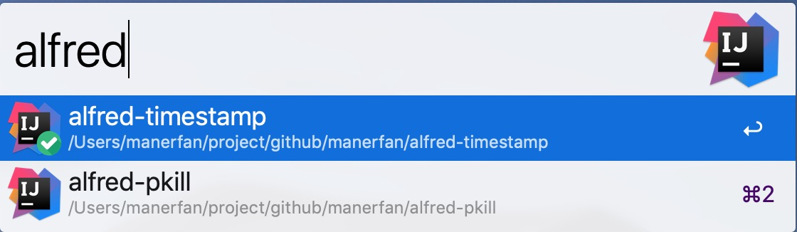

# alfred-idea

> [Alfred 3](https://www.alfredapp.com/) workflow，打开或切换idea工程 Open Recent project or Switch project window.




## Install

```js
$ npm install --global alfred-idea
```

Requires [Node.js](https://nodejs.org/) 4+ and the Alfred [Powerpack](https://www.alfredapp.com/powerpack/).

## Usage

In Alfred, type `idea`, <kbd>Enter</kbd> or <kbd>Space</kbd>, and the project key words.

alfred-idea will automatically find the corresponding project(s).

Press <kbd>Enter</kbd>, Open it or Switch it to the front.

## Related

- [alfy](https://github.com/sindresorhus/alfy) - Create Alfred workflows with ease
- [execa](https://github.com/sindresorhus/execa) - A better `child_process`
- [node-xml2js](https://github.com/Leonidas-from-XIV/node-xml2js) - Simple XML to JavaScript object converter.
- [which](https://github.com/isaacs/node-which) - Like the unix which utility.
- [user-home](https://github.com/sindresorhus/user-home) - Get the path to the user home directory

## License

[Apache 2.0](LICENSE) © [ManerFan](https://github.com/manerfan)